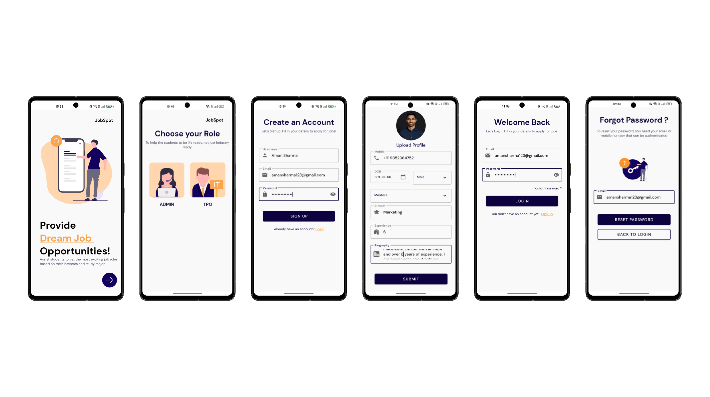
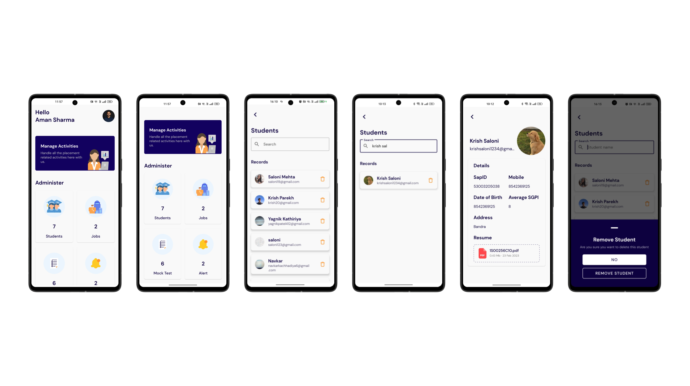
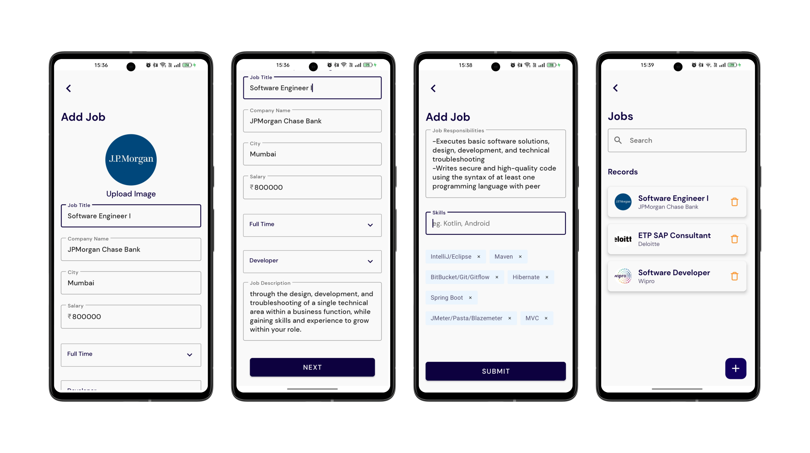
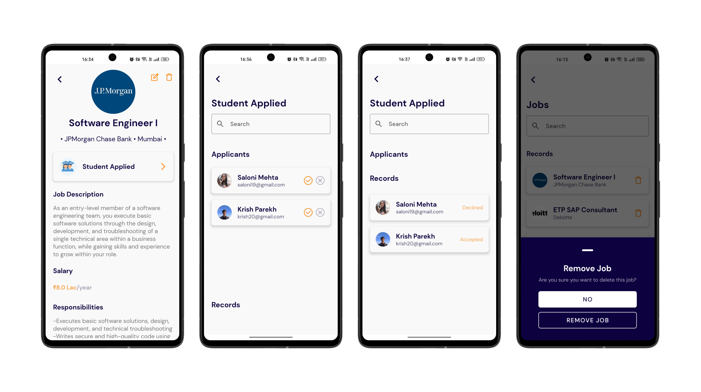
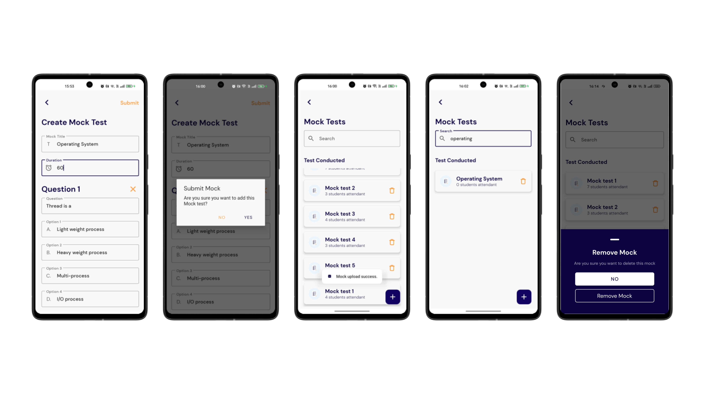
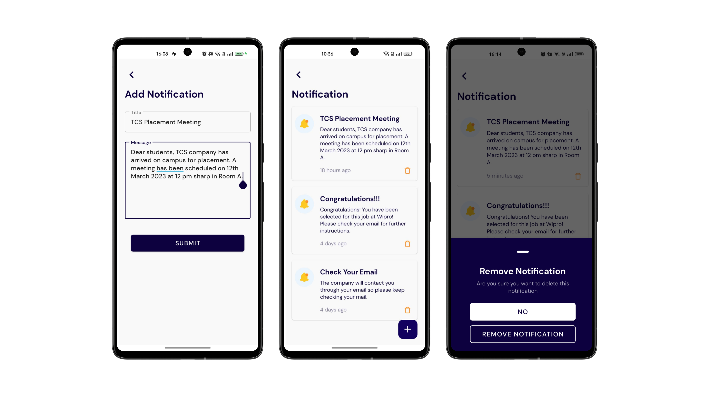
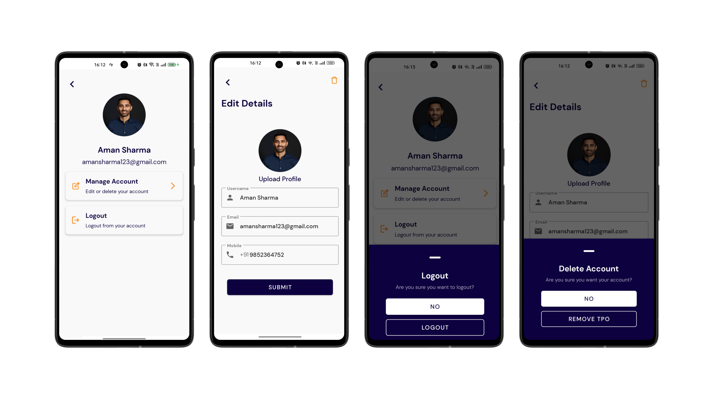
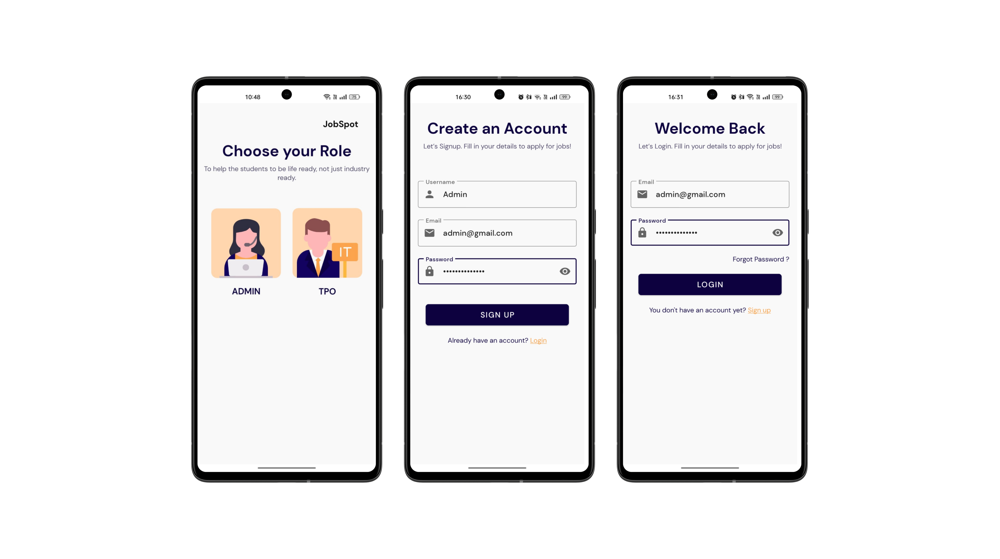
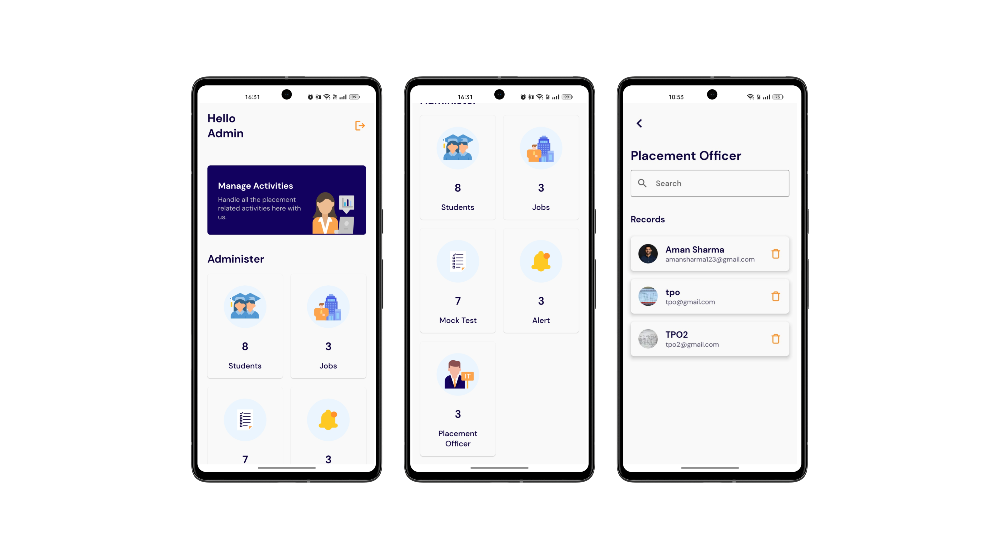
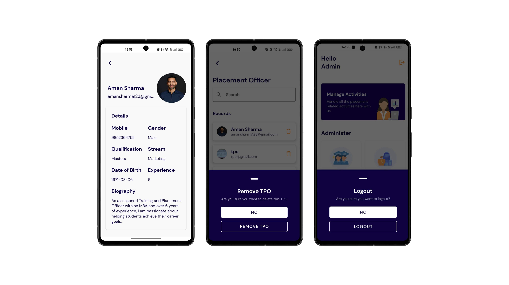

# JobSpot-Admin 👨‍💻

JobSpot-Admin is a mobile application designed for administrators and Training and Placement Officers (TPOs) to assist students in finding job opportunities and preparing for them. The app is managed by the admin and TPO, who post job opportunities, mock tests, notifications of interviews, and new companies for students to explore. They also provide feedback on student applications and update their application status, notifying them whether or not they have been selected for the job.

## Features

- **Job Management**: TPO and admin can add and delete jobs.Allows to create new job postings and remove outdated or irrelevant ones, keeping the job board up-to-date for students.

- **Mock Test Management**: Can create and manage mock tests for students. Allows TPO to prepare and administer practice exams to help students prepare for the actual recruitment process.

- **Notifications**: Send notifications related to interviews and new companies. This feature allows TPO to keep students informed about upcoming interviews and new companies that are recruiting, ensuring that students are well-informed and able to take advantage of relevant opportunities.

- **Application Status Updates**: TPO can update students' job application status. This feature allows TPO to keep track of students' job applications and update their status as needed, providing students with timely feedback on their applications.

- **Student Management**: TPO can delete students and view their details. This feature allows TPO to manage student records, including deleting records for students who are no longer enrolled or who have graduated and viewing students' details to better understand their interests and qualifications.

- **Admin Authority**: The admin has complete authority over all the functionalities and users of the app. They can manage and control the activities of TPOs and students, and perform all the necessary actions to ensure smooth functioning of the platform.

## Tech stack & Open-source libraries

- Minimum SDK level 27
- [Kotlin](https://kotlinlang.org/) based
- [Firebase](https://firebase.google.com/) - It provide backend services for the app. It has realtime database, auth, storage, and more.
- [Coil](https://coil-kt.github.io/coil/compose/) - An image loading library for Android backed by Kotlin Coroutines.
- [Material-Components](https://github.com/material-components/material-components-android) - Material design components for building ripple animation, and CardView.
- [Circular Image View](https://github.com/hdodenhof/CircleImageView) - A fast circular ImageView perfect for profile images.
- [Lottie Animation](https://github.com/airbnb/lottie-android) - Lottie is a mobile library for Android and iOS that parses Adobe After Effects animations exported as json with Bodymovin and renders them natively on mobile!
- [Splash Screen](https://developer.android.com/develop/ui/views/launch/splash-screen/) - The SplashScreen API enables a new app launch animation for all apps when running on a device with Android 12 or higher.
- [ViewPager2](https://developer.android.com/guide/navigation/navigation-swipe-view-2) - Swipe views allow you to navigate between sibling screens, such as tabs, with a horizontal finger gesture, or swipe. 
- [ImagePicker](https://github.com/Dhaval2404/ImagePicker) - Easy to use and configurable library to Pick an image from the Gallery or Capture image using Camera.
- [PowerSpinner](https://github.com/skydoves/PowerSpinner) - A lightweight dropdown popup spinner, fully customizable with an arrow and animations for Android.
- [SmoothBottomBar](https://github.com/ibrahimsn98/SmoothBottomBar) - A lightweight Android material bottom navigation bar library.


## Installation Guide

- Clone the repository by running the following command in your terminal:
```bash
 git clone https://github.com/Krish-Parekh/JobSpot-Admin.git
```

- Add the ```google-service.json``` file to your application. This file contains your Firebase project's configuration details and is required for your app to function properly. To get this file, follow these steps:
  - Go to the Firebase console and select your project.
  - Navigate to the project settings and select the "General" tab.
  - Scroll down to the section titled "Your apps" and select the Android app you've already created.
  - Click on the "Download google-services.json" button to download the file.
  - Copy the downloaded file into the ```app``` directory of your cloned repository.

- Build the app by running the following command in your terminal:
```bash
./gradlew build
```
This command will download any required dependencies, build the app, and generate an APK file.

- Run unit tests by running the following command in your terminal:
```bash
./gradlew test
```
This command will execute all unit tests defined in the project.

- Run the app by running the following command in your terminal:
```bash
./gradlew installDebug
```
This command will install the app on your connected Android device or emulator and launch it.

Congratulations 🎉, you've successfully installed and launched the app and run unit tests!

## Preview
| Login Signup Screen | TPO Home Student Screen |
| --- | --- |
|  |  |

| Add Job Screen | Job View Screen |
| --- | --- |
|  |  |

| Add Mock Screen | Add Alert Screen |
| --- | --- |
|  |  |

| Manage Account Screen | Admin Login Signup Screen |
| --- | --- |
|  |  |

| Admin Home Screen | Admin TPO Screen |
| --- | --- |
|  |  |


# Contributing to [JobSpot-Admin](https://github.com/Krish-Parekh/JobSpot-Admin)

Thank you for your interest in contributing to [JobSpot-Admin](https://github.com/Krish-Parekh/JobSpot-Admin)! We welcome contributions from anyone, regardless of their level of experience or expertise. This document outlines how to get started with contributing to the project.

## Prerequisites

Before you start, you will need to have the following tools and software installed:

- [Git](https://git-scm.com/downloads)
- [Android Studio](https://developer.android.com/studio)
- [Firebase](https://firebase.google.com/docs/android/setup)
- [Kotlin](https://kotlinlang.org/docs/home.html)

To contribute to [project name], follow these steps:

- Fork the project repository by clicking the "Fork" button on the top-right corner of the GitHub page.
- Clone the forked repository to your local machine using Git:
  ```bash
    git clone https://github.com/[your-github-username]/[project-name].git
  ```
- Create a new branch for your changes:
  ```bash
    git checkout -b [your-branch-name]
  ```
- Open the project in Android Studio.
- Make the necessary changes to the code and commit your changes using Git:
  ```bash
    git add .
    git commit -m "Your commit message here"
  ```
- Push your changes to your forked repository:
  ```bash
    git push origin [your-branch-name]
  ```
- Create a pull request by clicking the "New pull request" button on the top-right corner of the GitHub page.

## Code Style

Please follow the existing code style of the project when making changes. We use [Kotlin style guide](https://developer.android.com/kotlin/style-guide).

## Testing

Make sure to test your changes thoroughly before submitting a pull request. You can run the unit tests using the following command:

    ./gradlew test


## Reporting Bugs

If you find any bugs or issues with the project, please report them by opening a new issue on the GitHub repository.

